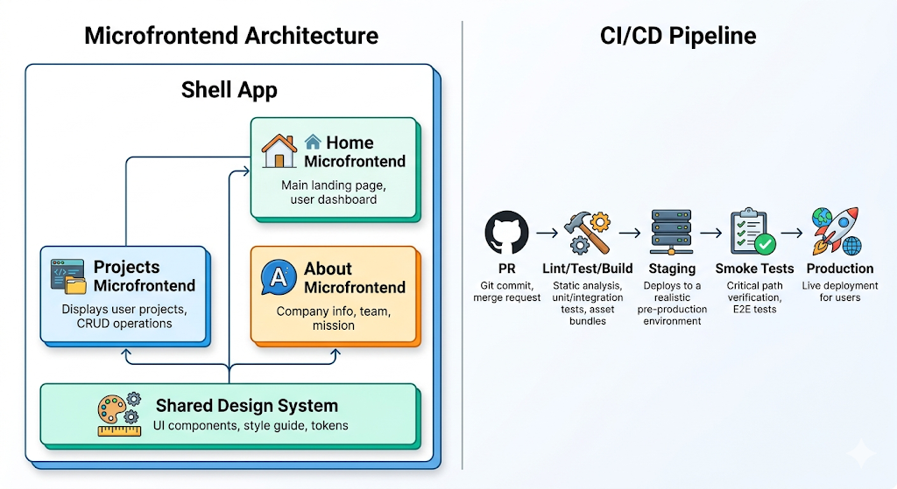

# Exercise 3: Architecture Reasoning (AI-assisted)

## Compared Microfrontend Strategies

When designing a scalable front-end architecture with microfrontends, there are several possible strategies.

### Iframe-based microfrontends

This strategy provides strong isolation because each application runs independently inside an iframe.

**Advantages**

High isolation between applications
Independent deployment
Technology flexibility for each team

**Disadvantages**

Poor integration between applications
Harder shared routing, state, and styling
Worse user experience and performance
Limited communication between modules

This approach is useful for legacy integrations, but it is not ideal for a modern, seamless user experience.

### Build-time integration

In this strategy, different front-end modules are developed separately but bundled together during the build process.

**Advantages**

Easier dependency management
Simpler local development
Good consistency across the application
Lower runtime complexity

**Disadvantages**

Less deployment independence
Teams are more coupled
Scaling multiple teams becomes harder over time

This is a good intermediate approach, but it does not fully support independent releases.

### Runtime integration with Module Federation

In this strategy, a host application loads independent microfrontends at runtime.

**Advantages**

Independent deployment by domain
Better scalability for multiple teams
Good integration and user experience
Shared dependencies can reduce duplication

**Disadvantages**

More architectural complexity
Version compatibility must be controlled
Runtime failures must be handled carefully

This is the most balanced option for a growing front-end platform.

### Recommended Strategy

I recommend a shell-based architecture with domain-oriented microfrontends loaded at runtime using Module Federation, combined with route-based ownership.

**Why this strategy**

This approach offers the best balance between scalability, maintainability, and developer experience.

Scalability: each domain can evolve independently.
Maintainability: boundaries follow business capabilities instead of arbitrary UI fragments.
Developer experience: the shell centralizes shared concerns while feature teams keep autonomy.
Proposed structure

The architecture would consist of:

Shell / Host Application

The shell is responsible for:

- global routing
- layout and navigation
- authentication/session context
- shared providers
- feature flags
- error boundaries
- loading remote microfrontends

The shell should remain lightweight and avoid owning heavy domain logic.

### Domain Microfrontends

Each microfrontend should map to a business domain, for example:

- Home / Marketing
- Projects
- About / Resume
- Account / Dashboard
- Admin / Content

Each domain owns:

- its pages
- business logic
- API communication
- local state
- tests

### Shared Layer

A shared layer should provide:

design system components
Tailwind conventions and tokens
icons
reusable utilities
shared TypeScript types where needed

This ensures consistency without creating excessive coupling.

### CI/CD Pipeline Design

The CI/CD pipeline should support both code quality and independent deployment.

#### Pull Request Validation

For every pull request:

- install dependencies
- run linting
- run type checks
- run unit tests
- verify build success
- run basic accessibility checks

This prevents broken code from being merged.

#### Merge to Main

When code is merged into main:

- build the affected shell or microfrontend
- run integration or smoke tests
- generate production artifacts
- deploy automatically to staging
- validate the deployment

#### Production Deployment

**For production releases:**

- promote the tested artifact from staging
- deploy only the affected microfrontend when possible
- keep version history for traceability
- enable rollback to the previous stable release

#### DevOps Practices Included

This pipeline should also include:

- environment separation: local, staging, production
- branch-based development workflow
- automated quality gates
- deployment traceability
- rollback strategy
- monitoring and alerting after release

A practical implementation could use GitHub Actions for CI/CD and a cloud hosting platform such as Vercel, Netlify, or another environment with CDN support.

### Scalability, Maintainability, and Performance Considerations
#### Scalability

This architecture scales well because:

- new domains can be added without restructuring the full application
- teams can work and deploy independently
- releases become smaller and less risky
- ownership boundaries are clearer

To support long-term scalability, domain contracts and shared dependency versions should be clearly defined.

#### Maintainability

This solution remains maintainable if:

- microfrontends are split by business domain, not by tiny UI elements
- a shared design system is enforced
- naming conventions and quality rules are standardized
- documentation exists for integration rules and ownership boundaries

A key principle is to avoid over-fragmentation. Not every component should become a microfrontend.

#### Performance

Microfrontends can introduce runtime overhead, so performance must be considered from the beginning.

Important decisions include:

- lazy loading remote modules
- route-based code splitting
- sharing React and other core libraries
- caching static assets with a CDN
- optimizing images and fonts
- showing fallback UI while remotes load

Key metrics to monitor:

- initial load time
- JavaScript bundle size
- Largest Contentful Paint
- remote loading failures
- runtime errors

### Risks and Mitigations

#### Risk: duplicated dependencies

Mitigation: share core libraries such as React and enforce compatible versions  .

#### Risk: inconsistent UI across teams

Mitigation: use a shared design system and common UI standards.

#### Risk: remote module loading failures

Mitigation: implement error boundaries, fallback UI, and monitoring.

#### Risk: overengineering

Mitigation: start with domain-based modularity and only adopt microfrontends where real separation adds value.

### Conclusion

The recommended solution is a shell-based microfrontend architecture using runtime integration with Module Federation and domain-based ownership. This strategy provides a strong balance between scalability, maintainability, and developer experience. Combined with a structured CI/CD pipeline and shared engineering standards, it supports long-term growth while preserving a coherent and performant user experience.

### AI Prompts Used

prompt 1: *with the file of the assessment on the context*, Design a scalable front-end architecture for a web application using microfrontends. Compare possible strategies and recommend one that balances scalability, maintainability, and developer experience. Give me the answer in a markdown file.

prompt 2: Create the next architecture diagram:
Shell App

├── Home Microfrontend

├── Projects Microfrontend

├── About Microfrontend

└── Shared Design System

CI/CD

PR → Lint/Test/Build → Staging → Smoke Tests → Production

